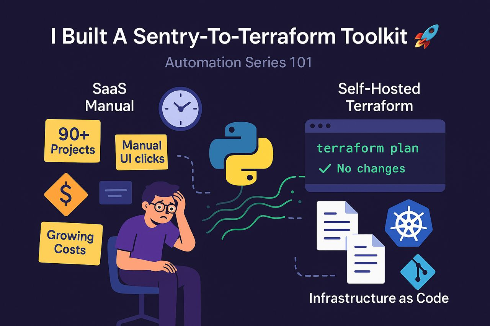

# Sentry Terraform Migration Toolkit

A powerful Python toolkit that transforms your manually-managed Sentry setup into Infrastructure as Code.



## 🎯 Purpose

This tool helps you migrate from manually managed Sentry projects, teams, and members to Terraform-managed infrastructure by:

- Discovering all existing Sentry resources via API
- Generating Terraform configuration files
- Creating import scripts for seamless migration
- Providing validation and best practices

## 📁 Repository Structure

```
.
├── README.md
├── LICENSE
├── requirements.txt
├── setup.py
├── Makefile
├── Dockerfile
├── get-pip.py
├── article-img.jpeg
├── .env
├── .gitignore
├── .sentry-discovery.yaml
├── docs/
│   └── guide.md
├── src/
│   └── sentry_discovery/
│       ├── __init__.py
│       ├── cli.py
│       ├── config.py
│       ├── discovery.py
│       ├── terraform.py
│       └── utils.py
├── terraform/
└── .github/
    └── workflows/
        └── ci.yml
```

## 🚀 Quick Start

### Installation

```bash
# Clone the repository
git clone https://github.com/litmus-paper-blue/sentry-terraform-discovery-toolkit.git
cd sentry-terraform-discovery-toolkit

# Install dependencies
pip install -r requirements.txt

# Or install as package
pip install -e .
```

Or use the Makefile for development:

```bash
make install-dev
```

### Basic Usage

```bash
# Interactive mode (uses config file if present)
sentry-discovery

# Direct command (overrides config file values)
sentry-discovery --token YOUR_TOKEN --org your-org-slug

# Generate only specific resources
sentry-discovery --token YOUR_TOKEN --projects-only

# Use custom templates
sentry-discovery --token YOUR_TOKEN --template-dir ./custom-templates
```

### Configuration File

Create `.sentry-discovery.yaml` in your project root (or home directory):

```yaml
sentry:
  base_url: "https://sentry.io/api/0"  # Or your self-hosted Sentry base URL
  token: "your-token-here"  # Required, or set SENTRY_AUTH_TOKEN env var
  organization: "your-default-org"

terraform:
  output_dir: "./terraform"
  import_script: true
```

- The `token` field is **required** in the config file, or you must set the `SENTRY_AUTH_TOKEN` environment variable.
- The config file is loaded first; CLI options only override if explicitly set.
- You will only be prompted if the output directory already exists and would be overwritten.

### Docker Usage

You can run the tool in Docker, mounting your config and output directories:

```bash
docker run --rm -it \
  -v $(pwd)/.sentry-discovery.yaml:/app/.sentry-discovery.yaml \
  -v $(pwd)/terraform:/app/terraform \
  -e SENTRY_AUTH_TOKEN \
  sentry-terraform-discovery:latest
```

### Output

The tool generates:
- `terraform/main.tf`          (Provider configuration)
- `terraform/variables.tf`     (Variable definitions)
- `terraform/teams.tf`         (Team resources)
- `terraform/projects.tf`      (Project resources)
- `terraform/imports.sh`       (Import script)

### Configuration Precedence

- The tool loads `.sentry-discovery.yaml` first.
- CLI options only override config file values if explicitly set.
- Prompts only occur for output directory conflicts.

### Troubleshooting

- **Token Issues:** Ensure your token is present in the config file or as `SENTRY_AUTH_TOKEN`. The token must be valid for your Sentry instance (self-hosted or SaaS).
- **Base URL:** For self-hosted Sentry, set the correct `base_url` (e.g., `https://your-sentry-instance/api/0`).
- **Import Errors:** Check that your organization slug and resource slugs are correct. The tool now generates import commands using the correct `org_slug/project_slug` format.
- **Makefile:** Use `make` commands for development, testing, and linting (see `Makefile`).

**Need help?** Open an issue or start a discussion!